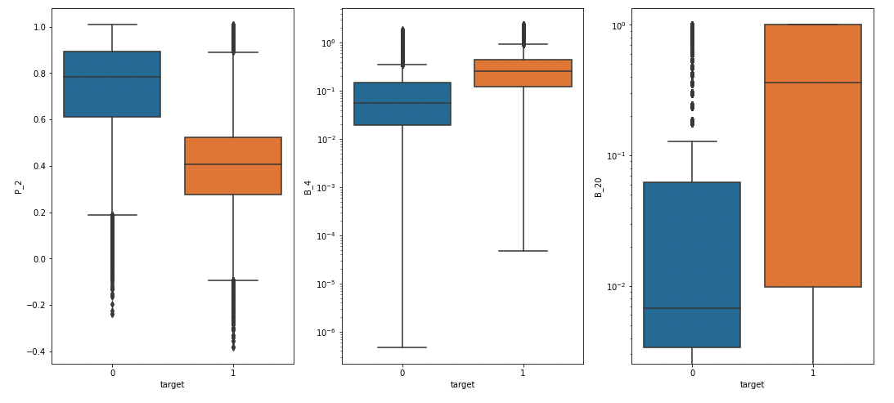
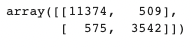

# Default prediction from American Express data

Credit default prediction is essential to managing risk in each lending decision. It allows lenders to optimize their lending decisions, which leads to a better customer experience and business economics. Therefore, a great credit default prediction model not only benefits lenders but also helps borrowers and pushes the economy forward in general. American Express is one of the largest credit card issuers in the world so they especially want to know if their customers are able to pay back. They also care about other patterns that we can get from our model to help them make better decisions in lending money to their customers if there is any.

Our goal is to build a model that can predict if a customer will default sometime in the future correctly. We also aim to get other meaningful insights from the data set to help American Express make better decisions in lending money to their clients. If the model is successful, American express can apply the model to create an automatic system to approve credit card applications and other applications to boost its business economics.

## 1. Data

The data we use is provided by American Express at https://www.kaggle.com/competitions/amex-default-prediction/data. This data set contains a train data table and a train labels table that we will use to train our model. It also contains a test set to test if our model performs well. 
There are 384 columns in total, which is divided into 5 categories: delinquency variables, spend variables, payment variables, balance variables, and risk variables. The train data set has 458,913 rows while the test data set has 100,000 rows.

## 2. Method

 Since our prediction is binomial (either a customer will default or not), we suggest using logistic regression as our main approach. The model can be improved by applying random forest method and cross validation. We also consider using abnormality detection since it is suitable for the problem we are solving.
 
 ## 3. Data cleaning
 
 There are several problems that we attacked in this data set.
 
 * **Problem 1:** The customer ID is non unique. To address this problem, we print out all duplicate value of customer ID to investigate further. It appears from the data set that these transactions contain important information for predicting fraud so we keep them.
 
  * **Problem 2:** There are 3 categorical columns. We delay them till EDA to figure out if they contain useful information and how to deal with them.
   
  * **Problem 2:** There are a lot of missing values, ranging from 100,000 to 0. We have plot the total number of missing values for all columns and use 90 percentage as the threshold to drop. The columns with >= 90 percent missing would be dropped. 
  
  ## 4. EDA
  
* **Finding 1:** The column 'S_2' contains information on the date of transaction. However, there is no difference from month to month for 'fraud' and 'non-fraud' cases. Therefore, this column contains no useful information for predicting fraud so it can be safely dropped. 
   
* **Finding 2:** On the other hand, the other categorical columns show big difference for 'fraud' and 'non-fraud' groups. Therefore, we hot encode them to include in our model. 
 
 * **Finding 3:** The columns that are most correlated with our target column are 'P_2', 'B_4' and 'B_20', with the boxplot as follows. 
 
 
   
  ## 5. Preprocessing and modeling
We use Logistic Regression, Gaussian Naive Bayes, LDA, Random Forest and Boosting and check their performance. We use F1-score and cross validation with 10 folds to evaluate these models. The result are as follows.

* **Logistic Regression:**  0.7384672352995632

* **Gaussian Naive Bayes:** 0.6968165337948162

* **LDA:** 0.7358437451324035

* **Random Forest:** 0.9214687500000001

* **Gradient Boosting:** 0.7684923076923077
  
  ## 6. Results
  
  Random forest performs the best with F1 score 0.92. After tuning using grid search, we end up with the model with max_features 0.2. Applying this model to the test data set, we obtain F1 score at 0.87. The confusion matrix is as follows.
  
   
  
  ## 7. Future improvements
  
Although the model yields very good result in prediction power, its training is quite slow due to the complexity of random forest with many features. We can improve the speed by more data cleaning and drop unnecessary columns. 